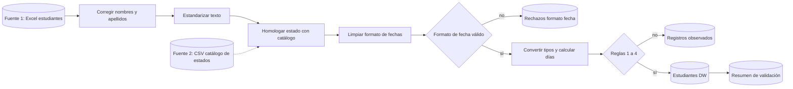
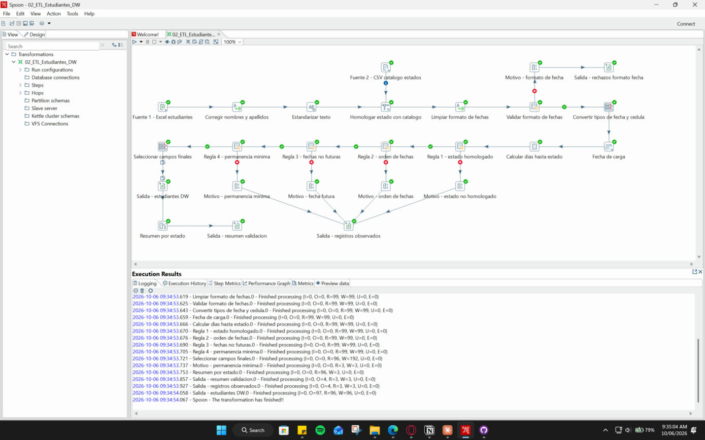
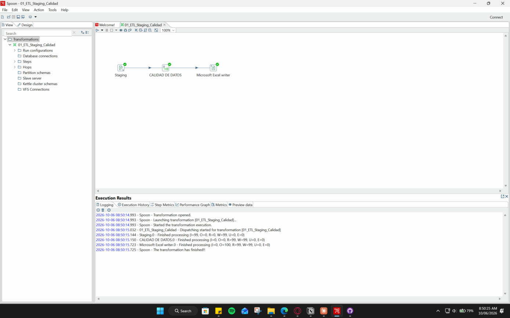
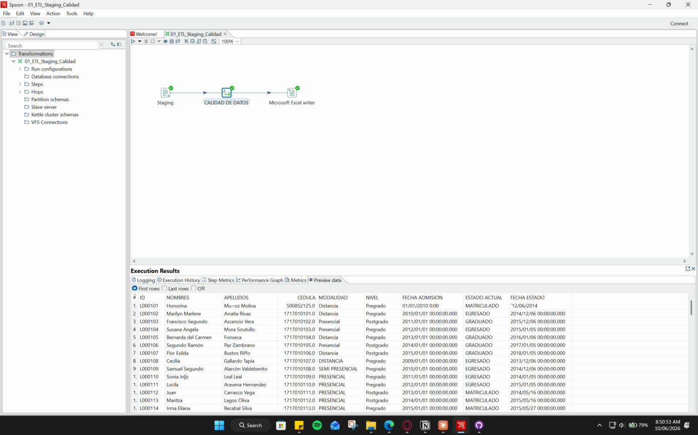
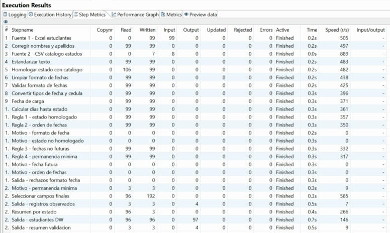
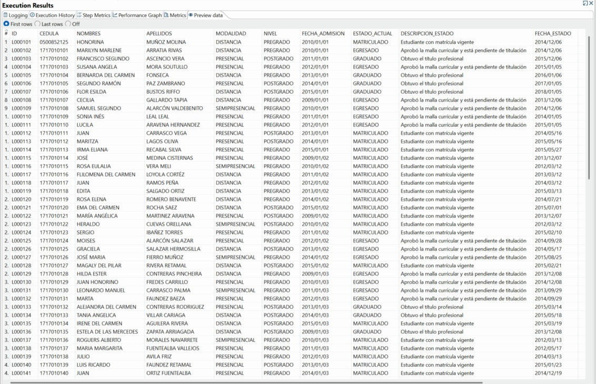
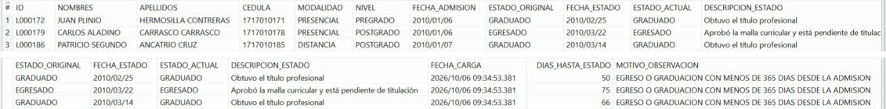
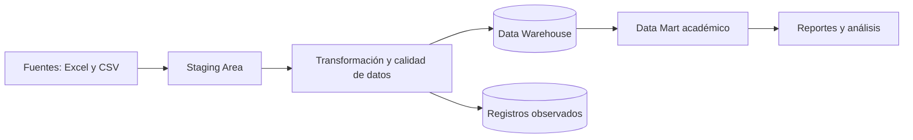

# Práctica 1: Implementación de un proceso ETL y Staging Area con Pentaho Data Integration

Escuela Politécnica Nacional
Facultad de Ingeniería de Sistemas
Business Intelligence

**Integrantes**

- Elian Daniel Caizapanta Caiza
- Brandon Javier Pallo Chango
- Alexis Eduardo Sotomayor Llerena
- Francisco Javier Torres Negrete

**Herramienta:** Pentaho Data Integration Community Edition 10.2.0.0-222 con Java 21

## Estructura de la carpeta

```
Practica 1/
├── README.md
├── datos/
│   ├── entrada/
│   │   ├── Caso Estudiantes Fechas Cedula.xls
│   │   └── catalogo_estados.csv
│   └── salida/
│       ├── SALIDA.xls
│       ├── ESTUDIANTES_DW.xlsx
│       ├── REGISTROS_OBSERVADOS.xlsx
│       └── RESUMEN_VALIDACION.xlsx
├── transformaciones/
│   ├── 01_ETL_Staging_Calidad.ktr
│   └── 02_ETL_Estudiantes_DW.ktr
├── validacion/
│   └── validar_resultados.py
└── evidencias/
```

La transformación `01_ETL_Staging_Calidad.ktr` corresponde a la parte guiada de la práctica y `02_ETL_Estudiantes_DW.ktr` al trabajo grupal. Las rutas de lectura y escritura se definieron con la variable `${Internal.Entry.Current.Directory}`, por lo que las transformaciones se pueden abrir y ejecutar en cualquier equipo después de clonar el repositorio, sin modificar ninguna configuración.

## 1. Objetivo del proceso

El objetivo es construir en Pentaho Data Integration un flujo completo de extracción, transformación y carga que tome la información académica de los estudiantes desde dos fuentes distintas, la reciba en una Staging Area, la limpie y estandarice, valide su consistencia y entregue un conjunto de datos confiable y listo para ser cargado en un Data Warehouse o Data Mart académico.

Sobre el dataset entregado por el docente se agregaron las dos transformaciones solicitadas: la corrección de nombres y apellidos y la validación de fechas.

## 2. Fuentes de datos utilizadas

Se trabajó con dos tipos de fuente diferentes.

| Fuente | Tipo | Paso en PDI | Descripción |
|---|---|---|---|
| Caso Estudiantes Fechas Cedula.xls | Excel 97-2003 | Microsoft Excel input | Hoja `Hoja1` con 99 estudiantes y los campos ID, nombres, apellidos, cédula, modalidad, nivel, fecha de admisión, estado actual y fecha de estado. Las hojas `Hoja2` y `Hoja3` están vacías. |
| catalogo_estados.csv | Archivo de texto delimitado por punto y coma, UTF-8 | CSV file input | Catálogo de referencia elaborado por el grupo que asocia cada forma en que aparece un estado con su valor oficial y una descripción. |

El catálogo contiene lo siguiente:

| ESTADO_ORIGEN | ESTADO_ESTANDAR | DESCRIPCION_ESTADO |
|---|---|---|
| MATRICULADO | MATRICULADO | Estudiante con matrícula vigente |
| EGRESADO, EGRESADA, EGR | EGRESADO | Aprobó la malla curricular y está pendiente de titulación |
| GRADUADO, GRADUADA, GRD | GRADUADO | Obtuvo el título profesional |

En el Excel se usó el motor JXL con codificación `windows-1252`. Con la codificación por defecto de Java el encabezado se lee como `FECHA ADMISI�N`, que es justamente lo que aparece en la captura de la guía, y lo mismo ocurre con los nombres que llevan tilde.

## 3. Problemas encontrados en los datos

Antes de diseñar las transformaciones se revisaron los 99 registros de la fuente. Estos fueron los problemas encontrados:

| Problema | Campo | Ejemplos | Registros |
|---|---|---|---|
| Caracteres dañados en lugar de la letra é | Nombres y apellidos | `Jos\|\|`, `In\|\|s`, `Cort\|\|z`, `Ren\|\|` | 8 |
| Caracteres dañados en lugar de la letra ñ | Nombres y apellidos | `Mu~oz`, `Pe~a`, `Iba~ez`, `Santiba~ez` | 6 |
| Espacios sobrantes al final o dobles | Nombres y apellidos | `Cecilia `, `Puga Wilson `, `Biava  Gonzalez` | 9 |
| Uso irregular de mayúsculas | Nombres y apellidos | `fierro Muñoz`, `Romero benavente`, `Maria margarita` | 10 |
| Un mismo estado escrito de varias formas | Estado actual | `Egresado`, `egresado`, `EGR`, `EGRESADA`, `Graduado`, `graduado`, `GRD` | 31 |
| Valores escritos en mayúsculas y minúsculas | Modalidad | `Presencial` y `PRESENCIAL`, `Semi Presencial` y `SEMI PRESENCIAL` | 99 |
| Valores escritos en mayúsculas y minúsculas | Nivel | `Pregrado` y `PREGRADO`, `Postgrado` y `POSTGRADO` | 99 |
| Fechas guardadas como texto | Fecha de admisión y fecha de estado | `01/01/2010 0:00` y `´12/06/2014`, con un acento al inicio | 1 |
| Cédula sin el cero inicial | Cédula | `500852125` y `95258652`, porque la columna se guardó como número | 2 |
| Estados que no concuerdan con las fechas | Estado y fechas | Estudiantes graduados o egresados a los 50, 66 y 75 días de haber sido admitidos | 3 |

La fecha `´12/06/2014` se interpretó como 6 de diciembre de 2014, es decir, en formato mes, día y año. Es el mismo formato de la otra fecha en texto del mismo registro y, además, los intervalos del dataset son exactos: con esa lectura el registro L000101 queda con 1800 días entre admisión y estado, igual que L000102, que tiene las mismas fechas.

También se detectaron dos posibles errores de digitación, `Flilomena` en L000117 y `Vilalobos` en L000165. No se corrigieron dentro del proceso porque un nombre propio solo debe modificarse después de confirmarlo con la fuente oficial, así que quedan registrados para su revisión.

## 4. Transformaciones aplicadas

### Parte guiada

La transformación `01_ETL_Staging_Calidad.ktr` sigue los pasos de la guía. El paso `Staging` lee el Excel, `CALIDAD DE DATOS` estandariza el estado con Replace in string y `Microsoft Excel writer` genera `SALIDA.xls`.

| Valor original | Valor estandarizado |
|---|---|
| Egresado, egresado, EGR, EGRESADA | EGRESADO |
| Graduado, graduado, GRD | GRADUADO |

Los reemplazos se configuraron sin distinguir mayúsculas y por palabra completa, para que `EGR` no altere la palabra `EGRESADO`. Al final quedan 99 registros con tres estados: 44 matriculados, 29 egresados y 26 graduados.

### Trabajo grupal

La transformación `02_ETL_Estudiantes_DW.ktr` integra las dos fuentes y aplica los siguientes pasos:

| Paso en Spoon | Tipo de paso | Función |
|---|---|---|
| Corregir nombres y apellidos | Replace in string | Reemplaza `\|\|` por é y `~` por ñ, reduce los espacios repetidos a uno solo y unifica `Semi Presencial` como `SEMIPRESENCIAL` |
| Estandarizar texto | String operations | Elimina espacios al inicio y al final y convierte a mayúsculas nombres, apellidos, modalidad, nivel y estado |
| Homologar estado con catalogo | Stream lookup | Busca cada estado en el CSV y devuelve el estado oficial y su descripción. Si el estado no existe en el catálogo, lo marca como `NO HOMOLOGADO` |
| Limpiar formato de fechas | Replace in string con expresiones regulares | Quita los caracteres extraños al inicio, convierte las fechas en formato mes/día/año a año/mes/día y descarta la hora |
| Validar formato de fechas | Filter rows | Comprueba que ambas fechas tengan el formato año/mes/día. Las que no lo cumplen se envían a `RECHAZOS_FORMATO_FECHA.xlsx` |
| Convertir tipos de fecha y cedula | Select values | Convierte las fechas de texto a tipo fecha y la cédula de número a texto de 10 dígitos, con lo que se recupera el cero inicial |
| Fecha de carga | Get system info | Agrega la columna `FECHA_CARGA` para saber en qué ejecución se cargó cada registro |
| Calcular dias hasta estado | Calculator | Calcula los días transcurridos entre la fecha de admisión y la fecha de estado |
| Regla 1 a Regla 4 | Filter rows | Aplican las reglas de validación que se describen abajo |
| Motivo | Add constants | Agrega a cada registro observado el motivo por el que no pasó la validación |
| Seleccionar campos finales y Salida estudiantes DW | Select values y Microsoft Excel writer | Ordenan las columnas y escriben los registros válidos |
| Resumen por estado | Memory group by | Cuenta los registros válidos por estado para conciliar la carga |

Las reglas de validación de fechas son cuatro:

1. El estado debe existir en el catálogo.
2. La fecha de estado no puede ser anterior a la fecha de admisión.
3. Ninguna de las dos fechas puede ser posterior a la fecha de carga.
4. Un estudiante egresado o graduado debe tener al menos 365 días entre su admisión y su fecha de estado.

Algunos ejemplos del antes y el después:

| Antes | Después |
|---|---|
| `Sonia In\|\|s`, `Leal Leal` | `SONIA INÉS`, `LEAL LEAL` |
| `Jos\|\| Maria`, `fierro Mu~oz` | `JOSÉ MARIA`, `FIERRO MUÑOZ` |
| `María Cristina `, `Biava  Gonzalez` | `MARÍA CRISTINA`, `BIAVA GONZALEZ` |
| `500852125` | `0500852125` |
| `01/01/2010 0:00` y `´12/06/2014` | `2010-01-01` y `2014-12-06` |
| `Semi Presencial` | `SEMIPRESENCIAL` |
| `GRD` | `GRADUADO` |

## 5. Flujo ETL desarrollado



Así se ve el flujo en Spoon después de su ejecución, con todos los pasos finalizados correctamente:



Para ejecutarlo desde Spoon se abre el archivo con File, Open y se presiona Run o F9. También se puede ejecutar desde la consola con Pan:

```bat
cd "D:\EPN\Septimo Semestre\Business Intelligence\Pentaho\data-integration"
Pan.bat /file:"D:\EPN\Septimo Semestre\Business Intelligence\Business-Intelligence\Practica 1\transformaciones\01_ETL_Staging_Calidad.ktr" /level:Basic
Pan.bat /file:"D:\EPN\Septimo Semestre\Business Intelligence\Business-Intelligence\Practica 1\transformaciones\02_ETL_Estudiantes_DW.ktr" /level:Basic
```

## 6. Evidencia del resultado

### Parte guiada

La transformación se ejecutó sin errores. `Staging` leyó 99 filas y `Microsoft Excel writer` escribió 100, que corresponden a los 99 registros más el encabezado.



En la vista previa de `CALIDAD DE DATOS` los estados ya aparecen estandarizados, mientras que los nombres y las fechas todavía muestran los problemas que se resuelven en el trabajo grupal.



### Trabajo grupal

Las métricas de ejecución muestran que de las 99 filas leídas, 96 llegaron a la salida final, 3 quedaron como observadas y ninguna fue rechazada por formato de fecha.



En la salida `ESTUDIANTES_DW` los nombres ya tienen tildes y eñes, la cédula tiene 10 dígitos, las fechas son válidas y cada estado aparece homologado con su descripción.



Los tres registros observados se guardan con el motivo correspondiente:



| ID | Estudiante | Estado | Admisión | Fecha de estado | Días | Motivo |
|---|---|---|---|---|---|---|
| L000172 | Juan Plinio Hermosilla Contreras | Graduado | 2010-01-06 | 2010-02-25 | 50 | Egreso o graduación con menos de 365 días desde la admisión |
| L000179 | Carlos Aladino Carrasco Carrasco | Egresado | 2010-01-06 | 2010-03-22 | 75 | Egreso o graduación con menos de 365 días desde la admisión |
| L000186 | Patricio Segundo Ancatrio Cruz | Graduado | 2010-01-07 | 2010-03-14 | 66 | Egreso o graduación con menos de 365 días desde la admisión |

### Validación de los resultados

| Control | Resultado |
|---|---|
| Filas de entrada frente a filas de salida | 99 = 96 cargadas + 3 observadas + 0 rechazadas |
| IDs duplicados en la salida | 0 |
| Estados que no existen en el catálogo | 0 |
| Fechas con formato inválido después de la limpieza | 0 |
| Fechas de estado anteriores a la admisión | 0 |
| Fechas posteriores a la fecha de carga | 0 |
| Egresos o graduaciones en menos de 365 días | 3, enviados a registros observados |
| Registros válidos por estado | 44 matriculados, 28 egresados y 24 graduados, que suman 96 |

Como control adicional, el script `validacion/validar_resultados.py` repite todo el procesamiento en Python a partir del Excel original y compara campo por campo su resultado con los archivos generados por Pentaho. Para ejecutarlo se necesitan las librerías pandas, xlrd y openpyxl.

```
python "Practica 1/validacion/validar_resultados.py"
```

```
[OK] ESTUDIANTES_DW.xlsx: 96 filas coinciden campo por campo con el calculo independiente
[OK] REGISTROS_OBSERVADOS.xlsx: 3 filas coinciden campo por campo con el calculo independiente
[OK] Conciliacion: 99 filas de entrada = 96 cargadas + 3 observadas + 0 rechazadas por formato
[OK] IDs duplicados en ESTUDIANTES_DW: 0
[OK] RESUMEN_VALIDACION cuadra con el detalle: {'EGRESADO': 28, 'MATRICULADO': 44, 'GRADUADO': 24}
[OK] SALIDA.xls de la guia: 99 filas, estados ['EGRESADO', 'GRADUADO', 'MATRICULADO']
```

Las reglas también se probaron con un archivo que tenía errores a propósito: una fecha de estado anterior a la admisión, un estado RETIRADO que no está en el catálogo, una fecha del año 2030 y una fecha ilegible. Cada uno de esos registros terminó en la salida que le correspondía y con el motivo correcto.

## 7. Relación con la arquitectura de un Data Warehouse



El proceso reproduce a pequeña escala las capas de un Data Warehouse. Las fuentes son un Excel académico y un catálogo en CSV, con formatos y niveles de calidad distintos, como sucede con los sistemas de una institución real. La lectura inicial cumple el papel de la Staging Area: los datos se extraen tal como vienen, con las fechas en texto y la cédula como número, para no perder información antes de procesarla. En un entorno productivo esta área sería un esquema de tablas temporales en la base de datos.

La etapa de transformación es donde se asegura la calidad. Allí se corrigen caracteres, se unifican los valores, se convierten los tipos de dato y se aplican las reglas de negocio. El catálogo de estados funciona como una dimensión conformada: todas las variantes apuntan a un único valor oficial, de modo que cualquier Data Mart que use estos datos reportará los mismos estados.

Los registros que no pasan las reglas no se eliminan. Se envían a una salida de observados junto con el motivo, que en un Data Warehouse equivale a una tabla de cuarentena. Así el almacén no recibe datos inconsistentes y tampoco se pierde información que el área responsable debe revisar. La columna `FECHA_CARGA` permite identificar en qué ejecución entró cada registro.

Por tratarse de una práctica, la carga final se hace en un archivo Excel. En una solución real el paso de salida sería Table output o Insert / Update hacia el Data Warehouse. Con estos datos se podría construir una tabla de hechos de trayectoria académica, con los días hasta el cambio de estado y el número de estudiantes como medidas, y las dimensiones estudiante, modalidad, nivel, estado y tiempo. El archivo `RESUMEN_VALIDACION.xlsx` es un primer ejemplo del tipo de consulta que respondería ese Data Mart.

## Conclusiones

Separar la extracción, la transformación y la carga permitió encontrar y corregir los problemas antes de que llegaran al destino final. Todos los registros necesitaron algún tipo de corrección o estandarización y tres de ellos no cumplieron las reglas de negocio.

Guardar la homologación de estados en un archivo externo resulta más fácil de mantener que escribir cada reemplazo dentro de la transformación, porque si aparece un estado nuevo basta con agregar una fila al catálogo.

La validación no debe descartar datos sin dejar rastro. Apartar los registros inconsistentes con su motivo permite revisarlos y corregirlos en el origen.

Finalmente, conciliar los conteos y comparar los resultados con un cálculo independiente da seguridad de que la salida está completa y es correcta.
