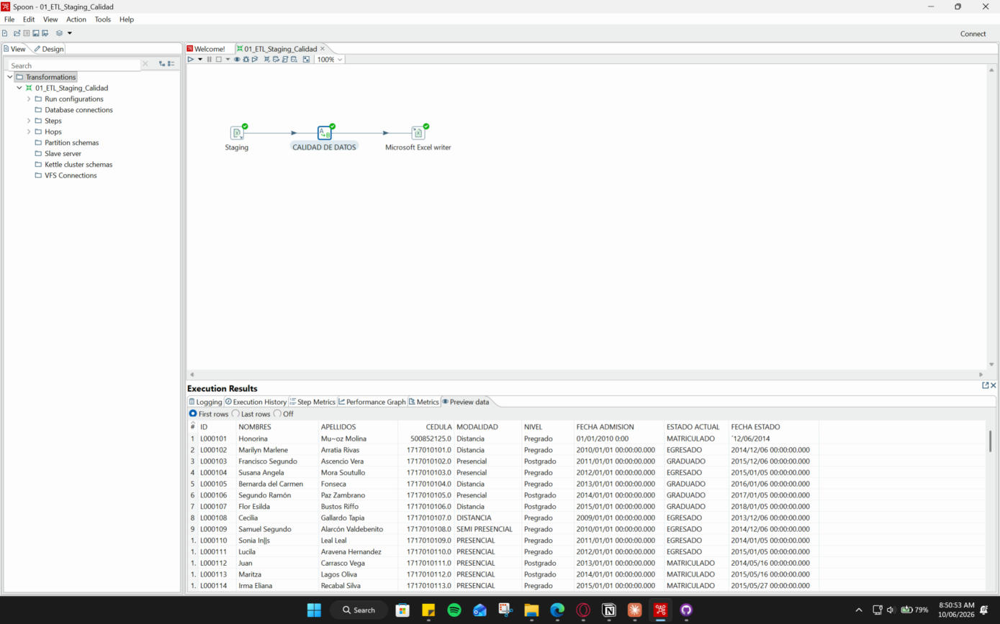
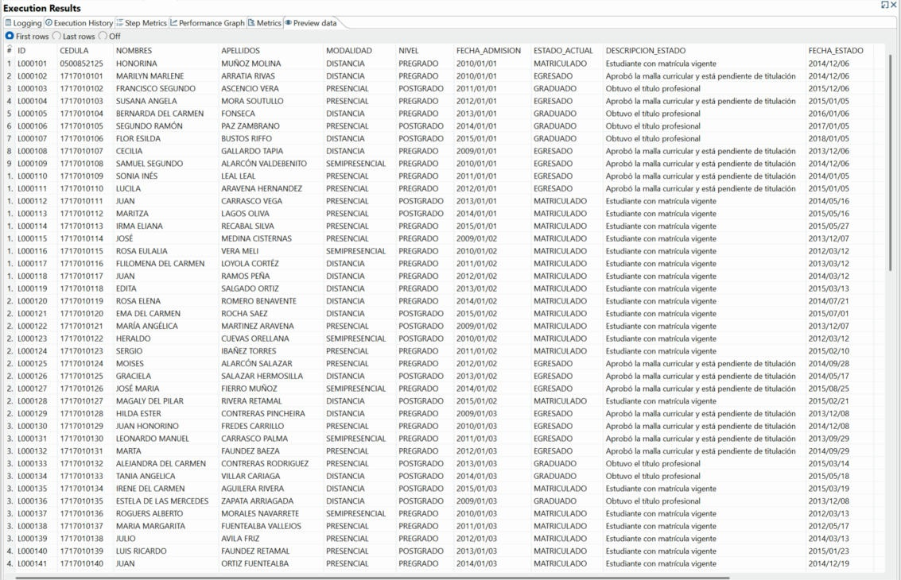
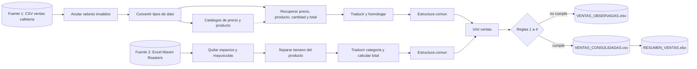
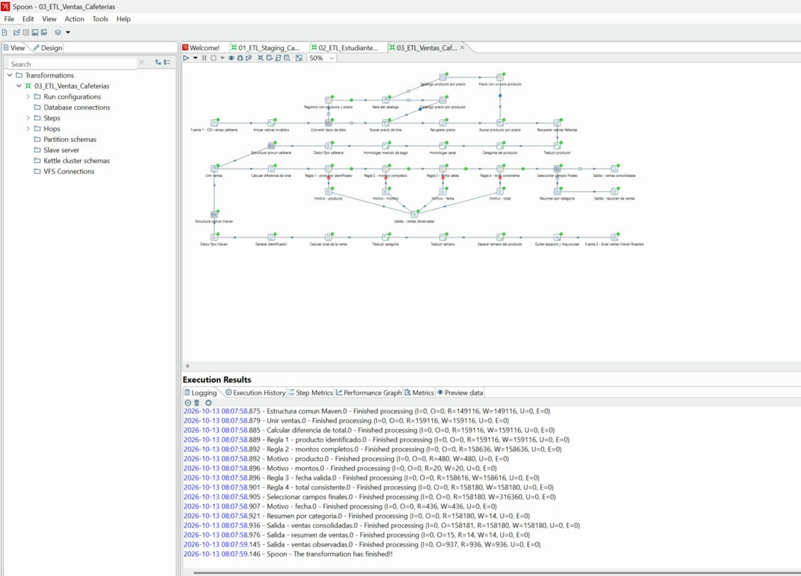
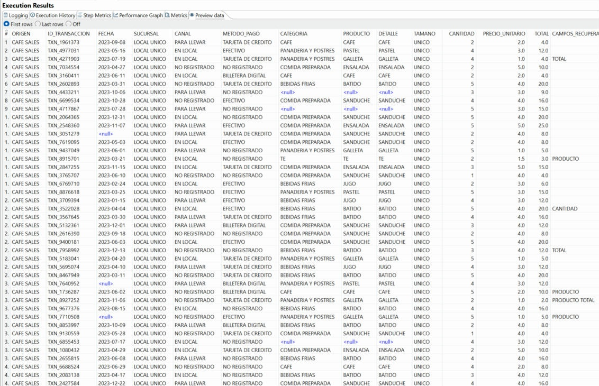
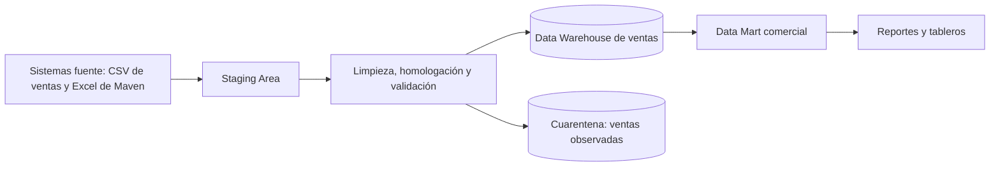

# Práctica 1: Implementación de un proceso ETL y Staging Area con Pentaho Data Integration

Escuela Politécnica Nacional

Facultad de Ingeniería de Sistemas

Business Intelligence

GR2SW

**Integrantes**

- Elian Daniel Caizapanta Caiza
- Brandon Javier Pallo Chango
- Alexis Eduardo Sotomayor Llerena
- Francisco Javier Torres Negrete

**Herramienta:** Pentaho Data Integration Community Edition 10.2.0.0-222 con Java 21

## Organización del trabajo

La práctica tiene tres componentes: la transformación guiada que se hizo en clase, el punto 1 del trabajo grupal, que pide agregar dos transformaciones al dataset entregado por el docente, y el punto 2, que pide diseñar un proceso ETL completo con dos tipos diferentes de fuentes de datos. Para que cada parte se pueda revisar por separado, el trabajo se dividió así:

| Parte | Qué cubre | Datos utilizados | Carpeta |
|---|---|---|---|
| Parte 1 | Práctica guiada y punto 1 del trabajo grupal | `Caso Estudiantes Fechas Cedula.xls`, entregado en clase | `parte1_estudiantes` |
| Parte 2 | Punto 2 del trabajo grupal | Dos datasets públicos de ventas de cafeterías: un CSV con datos sucios y un libro de Excel | `parte2_ventas_cafeterias` |

El dataset de estudiantes se usó únicamente para lo que la guía pide hacer sobre él. Para el punto 2 se buscaron fuentes externas reales, porque así el proceso enfrenta problemas de calidad que no fueron preparados para la clase y se puede demostrar la integración de dos formatos distintos en un mismo destino.

```
Practica 1/
├── README.md
├── parte1_estudiantes/
│   ├── datos/entrada/        Excel de estudiantes y catálogo de estados
│   ├── datos/salida/         SALIDA.xls, ESTUDIANTES_DW.xlsx, REGISTROS_OBSERVADOS.xlsx, RESUMEN_VALIDACION.xlsx
│   ├── transformaciones/     01_ETL_Staging_Calidad.ktr, 02_ETL_Estudiantes_Nombres_Fechas.ktr
│   ├── validacion/           validar_resultados.py
│   └── evidencias/
└── parte2_ventas_cafeterias/
    ├── datos/entrada/        dirty_cafe_sales.csv, Coffee Shop Sales.xlsx
    ├── datos/salida/         VENTAS_CONSOLIDADAS.csv, VENTAS_OBSERVADAS.xlsx, RESUMEN_VENTAS.xlsx
    ├── transformaciones/     03_ETL_Ventas_Cafeterias.ktr
    ├── validacion/           validar_resultados.py
    └── evidencias/
```

Todas las transformaciones leen y escriben con rutas relativas a partir de `${Internal.Entry.Current.Directory}`, así que funcionan en cualquier equipo después de clonar el repositorio.

---

# Parte 1: dataset de estudiantes

## Práctica guiada

La transformación `01_ETL_Staging_Calidad.ktr` reproduce los pasos de la guía. `Staging` lee el Excel, `CALIDAD DE DATOS` estandariza el estado académico con Replace in string y `Microsoft Excel writer` genera `SALIDA.xls`.

| Valor original | Valor estandarizado |
|---|---|
| Egresado, egresado, EGR, EGRESADA | EGRESADO |
| Graduado, graduado, GRD | GRADUADO |

Los reemplazos no distinguen mayúsculas y trabajan por palabra completa, para que `EGR` no altere la palabra `EGRESADO`. El resultado son 99 registros con tres estados: 44 matriculados, 29 egresados y 26 graduados.


En la vista previa de `CALIDAD DE DATOS` el estado ya está estandarizado, pero los nombres y las fechas todavía tienen los problemas que se corrigen en el punto 1.



## Punto 1: corrección de nombres y apellidos y validación de fechas

### Problemas encontrados

| Problema | Ejemplos | Registros |
|---|---|---|
| Caracteres dañados en lugar de la letra é | `Jos\|\|`, `In\|\|s`, `Cort\|\|z` | 8 |
| Caracteres dañados en lugar de la letra ñ | `Mu~oz`, `Pe~a`, `Iba~ez` | 6 |
| Espacios sobrantes al final o dobles | `Cecilia `, `Biava  Gonzalez` | 9 |
| Uso irregular de mayúsculas | `fierro Muñoz`, `Romero benavente` | 10 |
| Fechas guardadas como texto | `01/01/2010 0:00` y `´12/06/2014` | 1 |
| Cédula sin el cero inicial | `500852125`, `95258652` | 2 |
| Estados que no concuerdan con las fechas | Graduados o egresados a los 50, 66 y 75 días de su admisión | 3 |

La fecha `´12/06/2014` se interpretó como 6 de diciembre de 2014, en formato mes, día y año. Es el mismo formato de la otra fecha en texto del registro y con esa lectura el registro L000101 queda con 1800 días entre admisión y estado, igual que L000102, que tiene exactamente las mismas fechas. También se detectaron dos posibles errores de digitación, `Flilomena` y `Vilalobos`, que no se modificaron porque un nombre propio solo debe corregirse después de confirmarlo con la fuente oficial.

### Transformaciones aplicadas

La transformación `02_ETL_Estudiantes_Nombres_Fechas.ktr` aplica estos pasos:

| Paso en Spoon | Tipo de paso | Función |
|---|---|---|
| Corregir nombres y apellidos | Replace in string | Reemplaza `\|\|` por é y `~` por ñ, reduce los espacios repetidos y unifica `Semi Presencial` como `SEMIPRESENCIAL` |
| Estandarizar texto | String operations | Quita espacios sobrantes y convierte a mayúsculas |
| Homologar estado con catalogo | Stream lookup | Cruza el estado con `catalogo_estados.csv` para obtener el valor oficial y su descripción |
| Limpiar formato de fechas | Replace in string | Quita caracteres extraños, pasa las fechas de mes/día/año a año/mes/día y descarta la hora |
| Validar formato de fechas | Filter rows | Envía a `RECHAZOS_FORMATO_FECHA.xlsx` las fechas que no se pudieron interpretar |
| Convertir tipos de fecha y cedula | Select values | Convierte las fechas a tipo fecha y la cédula a texto de 10 dígitos |
| Fecha de carga y Calcular dias hasta estado | Get system info y Calculator | Agregan la fecha de carga y los días entre admisión y estado |
| Regla 1 a Regla 4 | Filter rows | Validan que el estado exista, que la fecha de estado no sea anterior a la admisión, que no haya fechas futuras y que nadie egrese o se gradúe en menos de 365 días |

| Antes | Después |
|---|---|
| `Sonia In\|\|s`, `Leal Leal` | `SONIA INÉS`, `LEAL LEAL` |
| `Jos\|\| Maria`, `fierro Mu~oz` | `JOSÉ MARIA`, `FIERRO MUÑOZ` |
| `500852125` | `0500852125` |
| `01/01/2010 0:00` y `´12/06/2014` | `2010-01-01` y `2014-12-06` |

### Resultado

De los 99 estudiantes, 96 pasan a `ESTUDIANTES_DW.xlsx` y 3 quedan en `REGISTROS_OBSERVADOS.xlsx` porque figuran como graduados o egresados a los 50, 66 y 75 días de haber sido admitidos.





---

# Parte 2: proceso ETL con dos fuentes externas

## 1. Objetivo del proceso

Integrar en un solo conjunto de datos las ventas de dos cafeterías que registran su información en sistemas y formatos diferentes, limpiar los errores de origen, homologar los catálogos de productos y validar cada venta antes de cargarla, de modo que el resultado pueda alimentar un Data Mart de ventas.

## 2. Fuentes de datos utilizadas

| | Fuente 1 | Fuente 2 |
|---|---|---|
| Nombre | Cafe Sales, Dirty Data for Cleaning Training | Coffee Shop Sales, Maven Roasters |
| Publicado en | [Kaggle](https://www.kaggle.com/datasets/ahmedmohamed2003/cafe-sales-dirty-data-for-cleaning-training) | [Maven Analytics Data Playground](https://mavenanalytics.io/data-playground/coffee-shop-sales) |
| Copia descargada | [github.com/Mehdi83/cafe-sales-cleaning](https://github.com/Mehdi83/cafe-sales-cleaning) | [github.com/Ayushi0214/Datasets](https://github.com/Ayushi0214/Datasets) |
| Tipo de fuente | Archivo de texto CSV separado por comas | Libro de Excel `.xlsx`, hoja `Transactions` |
| Paso en PDI | CSV file input | Microsoft Excel input con el motor Excel 2007 XLSX Apache POI Streaming |
| Registros | 10 000 | 149 116 |
| Periodo | Enero a diciembre de 2023 | Enero a junio de 2023 |
| Contenido | Producto, cantidad, precio unitario, total, método de pago, lugar de consumo y fecha | Fecha, hora, cantidad, local, producto, categoría, tipo y precio unitario de tres locales en Nueva York |

El CSV se descargó de una copia publicada en GitHub y se comparó con una segunda copia independiente: ambas tienen el mismo contenido byte por byte. Maven Analytics publica su dataset como dominio público.

## 3. Problemas encontrados en los datos

**Fuente 1, CSV de ventas.** De las 10 000 transacciones, 6 911 tienen al menos un campo dañado y solo 3 089 están completas. Los errores aparecen en todas las columnas excepto el identificador:

| Campo | Valor `ERROR` | Valor `UNKNOWN` | Vacío |
|---|---|---|---|
| Item | 292 | 344 | 333 |
| Quantity | 170 | 171 | 138 |
| Price Per Unit | 190 | 164 | 179 |
| Total Spent | 164 | 165 | 173 |
| Payment Method | 306 | 293 | 2 579 |
| Location | 358 | 338 | 3 265 |
| Transaction Date | 142 | 159 | 159 |

Además, todas las columnas numéricas llegan como texto porque mezclan números con esas palabras.

**Fuente 2, Excel de Maven Roasters.** Está mejor estructurado, pero no se puede integrar tal como viene:

| Problema | Detalle |
|---|---|
| Espacios sobrantes | 1 952 registros tienen espacios al final del nombre del producto, por ejemplo `Scottish Cream Scone ` |
| Tamaño mezclado en el nombre | 104 598 registros traen el tamaño pegado al nombre del producto: `Ethiopia Rg`, `Dark chocolate Lg`, `Columbian Medium Roast Sm` |
| Total ausente | No existe una columna con el total de la venta |
| Catálogo en inglés | Las nueve categorías y los tipos de producto están en inglés y no coinciden con los de la fuente 1 |
| Datos que la fuente no registra | No tiene método de pago ni lugar de consumo |

**Entre las dos fuentes.** Los nombres de columnas, los identificadores, el idioma y el nivel de detalle del producto son distintos: la fuente 1 vende ocho productos genéricos y la fuente 2 maneja 80 productos agrupados en 29 tipos.

## 4. Transformaciones aplicadas

**Limpieza y recuperación de la fuente 1**

| Paso en Spoon | Tipo de paso | Función |
|---|---|---|
| Anular valores invalidos | Replace in string | Convierte `ERROR` y `UNKNOWN` en valores vacíos para que se traten como nulos |
| Convertir tipos de dato | Select values | Convierte cantidad, precio y total a número y la fecha a tipo fecha |
| Registros con producto y precio, Catalogo precio por producto, Catalogo producto por precio | Filter rows y Memory group by | Construyen dos catálogos a partir de las ventas completas: el precio de lista de cada producto y los precios que corresponden a un solo producto |
| Buscar precio de lista y Recuperar precio | Stream lookup y User defined Java expression | Completan el precio usando el catálogo o, si el producto también falta, dividiendo el total para la cantidad |
| Buscar producto por precio y Recuperar valores faltantes | Stream lookup y User defined Java expression | Recuperan el producto a partir del precio cuando ese precio pertenece a un solo producto, y calculan la cantidad o el total que falten. La columna `CAMPOS_RECUPERADOS` deja constancia de lo que se completó |
| Traducir producto, Categoria del producto, Homologar canal, Homologar metodo de pago | Value mapper | Traducen los valores al español y asignan `NO REGISTRADO` cuando el dato no existe |

Los catálogos se construyen con los propios datos. En las ventas completas cada producto tiene un solo precio: café 2, té 1.5, galleta 1, ensalada 5, pastel y jugo 3, sánduche y batido 4. Los precios 1, 1.5, 2 y 5 identifican un único producto, así que se pueden usar para recuperarlo. Los precios 3 y 4 son compartidos y no permiten saber cuál fue el producto vendido. Con estas reglas se completaron datos en 1 682 ventas: 471 productos, 475 precios, 410 cantidades y 432 totales.

**Estandarización de la fuente 2**

| Paso en Spoon | Tipo de paso | Función |
|---|---|---|
| Quitar espacios y mayusculas | String operations | Elimina espacios sobrantes y pasa a mayúsculas local, categoría, tipo y producto |
| Separar tamano del producto | Replace in string con expresiones regulares | Separa el sufijo `SM`, `RG` o `LG` del nombre del producto |
| Traducir tamano y Traducir categoria | Value mapper | Convierten los tamaños en CHICO, MEDIANO y GRANDE, y las categorías al catálogo común en español |
| Calcular total de la venta | Calculator | Calcula el total como precio unitario por cantidad |
| Generar identificador | User defined Java expression | Antepone `MR-` al número de transacción para que no se confunda con los identificadores de la fuente 1 |

**Integración y validación**

Cada fuente termina en un paso de selección que deja exactamente las mismas columnas con los mismos tipos. Después, `Unir ventas` junta los dos flujos y todas las ventas pasan por las mismas reglas:

1. El producto debe estar identificado.
2. Cantidad, precio y total deben tener valor.
3. La fecha debe ser válida.
4. El total debe ser igual a la cantidad por el precio, con una tolerancia de un centavo.

Las ventas que no cumplen una regla se envían a `VENTAS_OBSERVADAS.xlsx` con su motivo. Las demás se escriben en `VENTAS_CONSOLIDADAS.csv` y se resumen por origen y categoría en `RESUMEN_VENTAS.xlsx`.

Catálogo común de categorías:

| Categoría común | Fuente 1 | Fuente 2 |
|---|---|---|
| CAFE | Coffee | Coffee |
| TE | Tea | Tea |
| PANADERIA Y POSTRES | Cake, Cookie | Bakery |
| BEBIDAS FRIAS | Smoothie, Juice | |
| COMIDA PREPARADA | Sandwich, Salad | |
| CHOCOLATE CALIENTE | | Drinking Chocolate |
| SABORIZANTES | | Flavours |
| CAFE EN GRANO | | Coffee beans |
| TE A GRANEL | | Loose Tea |
| CHOCOLATE EMPACADO | | Packaged Chocolate |
| MERCANCIA DE MARCA | | Branded |

## 5. Flujo ETL desarrollado


```mermaid
flowchart LR
    F1[(Fuente 1: CSV ventas cafeteria)] --> L1[Anular valores invalidos]
    L1 --> L2[Convertir tipos de dato]
    L2 --> C1[Catalogos de precio y producto]
    L2 --> L3[Recuperar precio, producto, cantidad y total]
    C1 -.-> L3
    L3 --> L4[Traducir y homologar]
    L4 --> E1[Estructura comun]
    F2[(Fuente 2: Excel Maven Roasters)] --> M1[Quitar espacios y mayusculas]
    M1 --> M2[Separar tamano del producto]
    M2 --> M3[Traducir categoria y calcular total]
    M3 --> E2[Estructura comun]
    E1 --> U[Unir ventas]
    E2 --> U
    U --> V{Reglas 1 a 4}
    V -- no cumple --> OB[(VENTAS_OBSERVADAS.xlsx)]
    V -- cumple --> DW[(VENTAS_CONSOLIDADAS.csv)]
    DW --> RS[(RESUMEN_VENTAS.xlsx)]
```

Así se ve en Spoon. La fuente 1 entra por la izquierda en la fila superior y la fuente 2 por la derecha en la fila inferior. Ambas se unen en `Unir ventas` y continúan por las reglas de validación.


Para ejecutarlo se abre `parte2_ventas_cafeterias/transformaciones/03_ETL_Ventas_Cafeterias.ktr` en Spoon y se presiona Run. Desde la consola:

```bat
cd "D:\EPN\Septimo Semestre\Business Intelligence\Pentaho\data-integration"
Pan.bat /file:"D:\EPN\Septimo Semestre\Business Intelligence\Business-Intelligence\Practica 1\parte2_ventas_cafeterias\transformaciones\03_ETL_Ventas_Cafeterias.ktr" /level:Basic
```

La transformación tiene configurado un tamaño de buffer de 20 000 filas entre pasos. Es necesario porque el mismo flujo de la fuente 1 alimenta al catálogo y a la búsqueda de precios: si el buffer fuera menor que las 10 000 ventas, la búsqueda esperaría al catálogo y el catálogo nunca terminaría de recibir filas.

## 6. Evidencia del resultado

La ejecución en Spoon termina sin errores:



Métricas por paso. Se leen 10 000 filas del CSV y 149 116 del Excel, se unen 159 116 y salen 158 180 consolidadas y 936 observadas:


Ventas de Maven Roasters ya integradas, con la categoría traducida, el producto separado de su tamaño y el total calculado:


Ventas de la cafetería después de la limpieza. La última columna indica qué valores se recuperaron. Las filas con `<null>` en producto son las que tienen precio 3 o 4 y no se pudieron identificar:



Ventas observadas con su motivo:


### Resultados

| Concepto | Fuente 1 CSV | Fuente 2 Excel | Total |
|---|---|---|---|
| Filas leídas | 10 000 | 149 116 | 159 116 |
| Ventas consolidadas | 9 064 | 149 116 | 158 180 |
| Observadas por producto no identificado | 480 | 0 | 480 |
| Observadas por montos sin valor recuperable | 20 | 0 | 20 |
| Observadas por fecha ausente o inválida | 436 | 0 | 436 |
| Observadas por total inconsistente | 0 | 0 | 0 |
| Monto vendido | 80 041.50 | 698 812.33 | 778 853.83 |

Resumen de ventas por categoría:

| Origen | Categoría | Transacciones | Unidades | Ventas |
|---|---|---|---|---|
| CAFE SALES | COMIDA PREPARADA | 2 285 | 6 911 | 31 288.00 |
| CAFE SALES | BEBIDAS FRIAS | 2 167 | 6 535 | 22 799.00 |
| CAFE SALES | PANADERIA Y POSTRES | 2 230 | 6 705 | 13 261.00 |
| CAFE SALES | CAFE | 1 241 | 3 766 | 7 532.00 |
| CAFE SALES | TE | 1 141 | 3 441 | 5 161.50 |
| MAVEN ROASTERS | CAFE | 58 416 | 89 250 | 269 952.45 |
| MAVEN ROASTERS | TE | 45 449 | 69 737 | 196 405.95 |
| MAVEN ROASTERS | PANADERIA Y POSTRES | 22 796 | 23 214 | 82 315.64 |
| MAVEN ROASTERS | CHOCOLATE CALIENTE | 11 468 | 17 457 | 72 416.00 |
| MAVEN ROASTERS | CAFE EN GRANO | 1 753 | 1 828 | 40 085.25 |
| MAVEN ROASTERS | MERCANCIA DE MARCA | 747 | 776 | 13 607.00 |
| MAVEN ROASTERS | TE A GRANEL | 1 210 | 1 210 | 11 213.60 |
| MAVEN ROASTERS | SABORIZANTES | 6 790 | 10 511 | 8 408.80 |
| MAVEN ROASTERS | CHOCOLATE EMPACADO | 487 | 487 | 4 407.64 |

### Validación de los resultados

Además de las reglas que aplica el propio ETL, el script `parte2_ventas_cafeterias/validacion/validar_resultados.py` vuelve a procesar las dos fuentes originales en Python, sin usar nada de lo que generó Pentaho, y compara el resultado campo por campo con los archivos de salida. Se ejecutó sobre los archivos que produjo Spoon:

```
[OK] VENTAS_CONSOLIDADAS.csv: 158180 filas coinciden campo por campo con el calculo independiente
[OK] VENTAS_OBSERVADAS.xlsx: 936 filas coinciden campo por campo con el calculo independiente
[OK] Conciliacion: 159116 filas leidas = 158180 consolidadas + 936 observadas
[OK] Identificadores duplicados en la salida: 0
[OK] RESUMEN_VENTAS cuadra con el detalle: 14 combinaciones de origen y categoria, ventas totales 778,853.83
```

Para repetir la validación se necesitan las librerías pandas, xlrd y openpyxl. La Parte 1 tiene su propio script en `parte1_estudiantes/validacion`.

## 7. Relación con la arquitectura de un Data Warehouse


```mermaid
flowchart LR
    A[Sistemas fuente: CSV de ventas y Excel de Maven] --> B[Staging Area]
    B --> C[Limpieza, homologación y validación]
    C --> D[(Data Warehouse de ventas)]
    C --> Q[(Cuarentena: ventas observadas)]
    D --> E[Data Mart comercial]
    E --> F[Reportes y tableros]
```

Las dos cafeterías representan los sistemas operacionales de una empresa: cada una exporta sus ventas con su propio formato, idioma y nivel de calidad. Los pasos de lectura cumplen la función de Staging Area, porque reciben los datos tal como vienen, todo como texto en el caso del CSV, para no perder información antes de procesarla. En un entorno productivo esta área sería un conjunto de tablas temporales en la base de datos.

La etapa de transformación es donde se resuelven las diferencias. El catálogo común de categorías funciona como una dimensión conformada: las dos fuentes quedan clasificadas con los mismos valores, así que un reporte puede comparar el café vendido en ambas sin ajustes manuales. La recuperación de valores con catálogos derivados de los propios datos es un ejemplo de regla de calidad documentada, y la columna `CAMPOS_RECUPERADOS` conserva el linaje de cada dato que no vino de origen.

Las ventas que no superan las reglas no se pierden ni contaminan el almacén: quedan en una salida de cuarentena con su motivo para que el área responsable las revise. Por tratarse de una práctica, la carga final se hace en archivos. En una solución real `VENTAS_CONSOLIDADAS` se cargaría con Table output a una tabla de hechos.

Con estos datos se puede construir un modelo estrella con una tabla de hechos de ventas, cuyas medidas serían cantidad, precio unitario y total, y las dimensiones fecha, producto con su categoría, detalle y tamaño, sucursal, canal de consumo, método de pago y origen. `RESUMEN_VENTAS.xlsx` es un primer ejemplo de las consultas que respondería el Data Mart.

---

## Conclusiones

En la Parte 1, separar la lectura, la transformación y la carga permitió corregir los nombres y las fechas del dataset de estudiantes antes de llegar al destino. Las reglas de validación detectaron tres estudiantes con fechas que no tienen sentido para su estado académico.

En la Parte 2 se integraron dos fuentes reales con formatos distintos. Casi siete de cada diez registros del CSV tenían algún error. Gracias a los catálogos construidos con los propios datos se recuperó información en 1 682 ventas que de otra forma se habrían descartado, y solo 936 de 159 116 registros quedaron en observación.

Homologar las categorías en un catálogo común es lo que hace posible analizar juntas dos fuentes que no fueron diseñadas para integrarse.

La conciliación de conteos y la comparación con un cálculo independiente dan seguridad de que las salidas están completas y son correctas.
